# Factory Platform

[](https://github.com/horizoonn/factory-platform/actions/workflows/ci.yml)
[](https://github.com/horizoonn/factory-platform/actions/workflows/ci.yml)
[](https://go.dev/)

Микросервисная платформа для оформления, оплаты и асинхронной сборки космических кораблей. Клиент создаёт заказ из доступных деталей, оплачивает его через PaymentService, после чего AssemblyService запускает сборку и сообщает OrderService о её завершении.

Синхронные операции выполняются через HTTP и gRPC, а изменения между сервисами распространяются через Kafka. PostgreSQL используется как источник истины, Transactional Outbox обеспечивает надёжную публикацию событий, а Inbox — идемпотентную обработку повторных доставок.

## Возможности

- создание заказа из доступных на складе деталей;
- расчёт стоимости заказа через InventoryService;
- оплата заказа через PaymentService;
- асинхронная сборка корабля после события `OrderPaid`;
- автоматический переход заказа в `COMPLETED` после события `ShipAssembled`;
- отмена заказа до оплаты;
- атомарное сохранение состояния и исходящего события в PostgreSQL;
- повторная публикация событий с lease, backoff и ограничением числа попыток;
- идемпотентная обработка повторно доставленных событий;
- unit-, integration- и end-to-end-тесты.

## Архитектура

```mermaid
flowchart TB
    Client([Client])

    subgraph Sync["Синхронное взаимодействие"]
        direction LR
        Order[OrderService]
        Inventory[InventoryService]
        Payment[PaymentService]

        Order -->|gRPC: ListParts| Inventory
        Order -->|gRPC: PayOrder| Payment
    end

    Client -->|HTTP: заказы| Order
    Client -->|HTTP / gRPC: каталог деталей| Inventory

    Order -->|orders, outbox, inbox| OrderDB[(Order PostgreSQL)]
    Inventory -->|parts| InventoryDB[(Inventory PostgreSQL)]

    subgraph Async["Асинхронный цикл сборки"]
        direction LR
        OrderDispatcher[Outbox dispatcher]
        Kafka[(Kafka)]
        Assembly[AssemblyService]
        AssemblyDB[(Assembly PostgreSQL<br/>delayed outbox)]
        AssemblyDispatcher[Delayed outbox dispatcher]

        OrderDispatcher -.->|publish: order.paid.v1| Kafka
        Kafka -.->|OrderPaid| Assembly
        Assembly -->|schedule assembly| AssemblyDB
        AssemblyDB --> AssemblyDispatcher
        AssemblyDispatcher -.->|publish: assembly.ship-assembled.v1| Kafka
        Kafka -.->|ShipAssembled| Order
    end

    OrderDB -.->|claim pending events| OrderDispatcher

    classDef external fill:#f8fafc,stroke:#475569,stroke-width:2px,color:#0f172a;
    classDef service fill:#dbeafe,stroke:#2563eb,stroke-width:2px,color:#172554;
    classDef storage fill:#dcfce7,stroke:#16a34a,stroke-width:2px,color:#052e16;
    classDef broker fill:#fef3c7,stroke:#d97706,stroke-width:2px,color:#451a03;
    classDef worker fill:#f3e8ff,stroke:#9333ea,stroke-width:2px,color:#3b0764;

    class Client external;
    class Order,Inventory,Payment,Assembly service;
    class OrderDB,InventoryDB,AssemblyDB storage;
    class Kafka broker;
    class OrderDispatcher,AssemblyDispatcher worker;
```



### Сервисы

| Компонент | Интерфейс | Назначение | Хранилище |
| --- | --- | --- | --- |
| `order` | HTTP `:8080`, Kafka producer/consumer | Управляет жизненным циклом заказа и координирует оплату | PostgreSQL `:5434` |
| `inventory` | HTTP `:8082`, gRPC `:50051` | Хранит детали, фильтрует их и возвращает цены | PostgreSQL `:5433` |
| `payment` | gRPC `:50052` | Регистрирует оплату и создаёт UUID транзакции | — |
| `assembly` | Kafka consumer/producer | Планирует сборку оплаченного корабля и публикует результат | PostgreSQL `:5435` |
| `platform` | Go packages | Общие адаптеры PostgreSQL, Kafka, логирования и тестовой инфраструктуры | — |
| `shared` | OpenAPI и Protobuf | Межсервисные контракты и сгенерированный код | — |

Kafka доступна локально на `localhost:9092`, Kafka UI — на [localhost:8081](http://localhost:8081).

### Жизненный цикл заказа

```text
PENDING_PAYMENT ── pay ──> PAID ── ShipAssembled ──> COMPLETED
       │
       └──────── cancel ──────────> CANCELLED
```

Полный сценарий обработки заказа выглядит следующим образом:

1. OrderService получает заказ и проверяет его состояние.
2. InventoryService предоставляет данные о деталях при создании заказа.
3. PaymentService возвращает идентификатор платёжной транзакции.
4. В одной транзакции PostgreSQL заказ переводится в `PAID`, а `OrderPaid` сохраняется в outbox.
5. Dispatcher публикует событие в топик `order.paid.v1`.
6. AssemblyService принимает событие и планирует `ShipAssembled` через delayed outbox.
7. Событие публикуется в `assembly.ship-assembled.v1` после завершения сборки, которая в текущей конфигурации занимает 10 секунд.
8. OrderService в одной транзакции регистрирует event UUID в inbox и переводит заказ в `COMPLETED`.
9. Kafka offset коммитится только после успешной обработки сообщения.

## Архитектурные решения

### Взаимодействие сервисов

Внешний клиент работает с OrderService по HTTP. Синхронные запросы к InventoryService и PaymentService выполняются по gRPC, когда вызывающему сервису нужен немедленный ответ. Kafka используется для событий, которые продолжают бизнес-процесс асинхронно: `OrderPaid` запускает сборку, а `ShipAssembled` завершает заказ.

### Изоляция данных

OrderService, InventoryService и AssemblyService используют отдельные экземпляры PostgreSQL и не обращаются к таблицам друг друга. Изменения между границами сервисов передаются только через публичные gRPC-контракты и Kafka-события. PaymentService не хранит состояние в базе данных.

### Transactional Outbox и Inbox

Kafka-консьюмеры работают в модели at-least-once, поэтому одно сообщение может быть доставлено повторно. Проект учитывает это на уровне базы данных:

- OrderService атомарно обновляет заказ и добавляет `OrderPaid` в outbox;
- уникальность исходного события не позволяет AssemblyService повторно запланировать одну и ту же сборку;
- inbox OrderService не позволяет повторно применить один `ShipAssembled`;
- dispatcher захватывает события по lease и повторяет публикацию с backoff;
- достижение `OUTBOX_MAX_ATTEMPTS` переводит событие в состояние окончательной ошибки.

Такая схема гарантирует согласованность локальной транзакции и последующую публикацию события, но не превращает вызов PaymentService и транзакцию OrderService в одну распределённую транзакцию.

## Технологический стек

| Компонент | Технология |
| --- | --- |
| Язык | Go 1.26.2, Go workspace |
| HTTP | `net/http`, OpenAPI 3, ogen |
| RPC | gRPC, Protocol Buffers |
| Брокер сообщений | Apache Kafka в KRaft-режиме, franz-go |
| База данных | PostgreSQL, jackc/pgx/v5 |
| Миграции | Goose |
| Валидация | Protovalidate, ogen validators |
| Конфигурация | kelseyhightower/envconfig |
| Логирование | go.uber.org/zap |
| Тестирование | testing, Testify, Testcontainers, Mockery |
| Генерация контрактов | Buf, protoc, ogen, Redocly CLI |
| Форматирование и lint | gofumpt, gci, golangci-lint |
| Локальное окружение | Docker Compose, Taskfile |
| CI | GitHub Actions |

## Структура репозитория

```text
.
├── assembly/       # обработка OrderPaid и публикация ShipAssembled
├── inventory/      # каталог деталей и Inventory gRPC API
├── order/          # Order HTTP API, координация, outbox и inbox
├── payment/        # Payment gRPC API
├── platform/       # переиспользуемые технические компоненты
├── shared/         # OpenAPI/Protobuf-контракты и сгенерированный код
├── deploy/         # Compose-файлы и шаблоны окружения
├── Taskfile.yml    # единая точка входа для локальных команд
└── go.work         # Go workspace
```

Код каждого сервиса разделён по ответственности:

```text
internal/
├── api/            # входящие HTTP, gRPC и Kafka-адаптеры
├── service/        # сценарии приложения и бизнес-оркестрация
├── domain/         # доменные модели, события и ошибки
├── repository/     # адаптеры доступа к данным
├── client/         # исходящие gRPC-адаптеры, если нужны
├── outbox/         # модель, кодирование и публикация событий
├── config/         # конфигурация приложения
└── app/            # сборка зависимостей и lifecycle приложения
```

### Направление зависимостей

Интерфейсы внешних зависимостей объявляются на стороне использующего их пакета. Например, сервис заказов зависит от собственных интерфейсов `Repository`, `InventoryClient`, `PaymentClient` и `OrderPaidEncoder`, а конкретные реализации подключаются в `internal/app/di.go`.

Доменные и сервисные слои работают с внутренними моделями и не зависят от Protobuf-сообщений, Kafka-сообщений или конкретных PostgreSQL-клиентов. Входящие адаптеры декодируют транспортные контракты, сервисный слой выполняет бизнес-сценарий, а репозиторные и клиентские адаптеры реализуют исходящие зависимости.

## Быстрый старт

### Требования

- Go `1.26.2`;
- Docker с Compose plugin;
- [Task](https://taskfile.dev/);
- Git;
- свободные порты `8080`–`8082`, `50051`, `50052`, `5433`–`5435` и `9092`.

Для генерации OpenAPI-кода также нужны Node.js и npm. Команда `task test-api` использует `curl` и `uuidgen`.

### Запуск

```bash
git clone https://github.com/horizoonn/factory-platform.git
cd factory-platform

# Создать локальные env-файлы из deploy/env/.env.template.
task env:generate

# Запустить Kafka, Kafka UI и PostgreSQL, затем применить миграции.
task env:bootstrap

# Запустить четыре сервиса локально.
task run:all
```

Чтобы собрать и запустить инфраструктуру и все четыре сервиса в Docker:

```bash
task env:generate
task deploy:up
```

Контейнеры приложений самостоятельно применяют миграции при старте. Внутри
Docker-сети сервисы обращаются к Kafka и друг к другу по именам контейнеров,
а наружу публикуются те же HTTP- и gRPC-порты, что и при локальном запуске.
Остановить контейнерное окружение можно командой `task deploy:down`.

При первом вызове Task автоматически установит необходимые локальные утилиты в `./bin`. Значения портов и учётные данные локального окружения можно изменить в `deploy/env/.env` и повторно выполнить `task env:generate`.

После запуска доступны:

- Order HTTP API: [http://localhost:8080](http://localhost:8080);
- Order Swagger UI: [http://localhost:8080/docs/](http://localhost:8080/docs/);
- health check: [http://localhost:8080/health](http://localhost:8080/health);
- Kafka UI: [http://localhost:8081](http://localhost:8081);
- Inventory HTTP API: [http://localhost:8082/api/v1/parts](http://localhost:8082/api/v1/parts);
- Inventory Swagger UI: [http://localhost:8082/docs/](http://localhost:8082/docs/);
- Inventory gRPC: `localhost:50051`;
- Payment gRPC: `localhost:50052`.


Остановка локальной инфраструктуры:

```bash
task env:down
```

## API и контракты

OrderService предоставляет следующие HTTP-операции:

| Метод | Путь | Назначение |
| --- | --- | --- |
| `POST` | `/api/v1/orders` | Создать заказ |
| `GET` | `/api/v1/orders/{order_uuid}` | Получить заказ |
| `POST` | `/api/v1/orders/{order_uuid}/pay` | Оплатить заказ |
| `POST` | `/api/v1/orders/{order_uuid}/cancel` | Отменить заказ |
| `GET` | `/health` | Проверить состояние OrderService |

InventoryService предоставляет HTTP/JSON API через gRPC-Gateway и сохраняет
исходный gRPC API для межсервисного взаимодействия:

| Метод | Путь | Назначение |
| --- | --- | --- |
| `GET` | `/api/v1/parts` | Получить список доступных деталей |
| `GET` | `/api/v1/parts/{uuid}` | Получить деталь по UUID |

Фильтры списка передаются в query string согласно структуре `PartsFilter`,
например:

```bash
curl 'http://localhost:8082/api/v1/parts?filter.categories=CATEGORY_ENGINE&filter.tags=critical'
```

Исходный OpenAPI-контракт OrderService находится в [`shared/api/order/v1`](shared/api/order/v1), Protobuf-контракты — в [`shared/proto`](shared/proto), а сгенерированный Swagger InventoryService — в [`shared/api/generated`](shared/api/generated). Swagger UI загружает интерфейс из CDN, поэтому для открытия страниц документации нужен доступ к интернету. Сгенерированные файлы вручную не редактируются.

Повторная генерация контрактов:

```bash
task gen
```

## Тестирование и качество кода

```bash
# Unit-тесты всех модулей.
task test

# Integration-тесты репозиториев и outbox/inbox с Testcontainers.
task test-integration MODULES="assembly inventory order"

# Полный пользовательский сценарий в реальном окружении Testcontainers.
task test-e2e MODULES="inventory order"

# Покрытие сервисного и репозиторного слоёв.
task test-coverage

# Форматирование, lint Protobuf/Go и unit-тесты перед коммитом.
task check
```

Для integration- и E2E-тестов должен быть запущен Docker daemon. CI выполняет lint, unit- и integration-тесты; отчёт о покрытии обновляется при push в `main`.

Полный список доступных команд:

```bash
task --list-all
```

## Полезные команды

```bash
task env:up                # поднять только локальную инфраструктуру
task db:migrate:all        # применить все миграции
task run:order             # запустить один сервис
task proto:lint            # проверить Protobuf-контракты
task mockery:gen           # перегенерировать моки
task format                # применить gofumpt и gci
task lint                  # запустить golangci-lint
```
